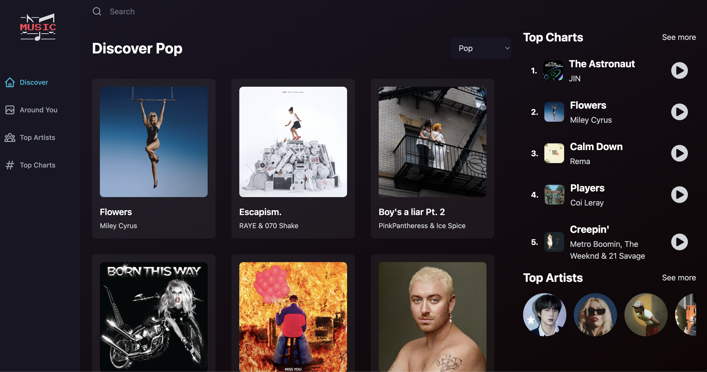

# Music Player Application

[Live Site 🌍](https://music-listener.netlify.app/)

## Description
Developed a music player application using React JS, Redux, Tailwind CSS and Rapid API.
The application has similar functionalities to Spotify like searching and listening to songs.

## Technologies
* React JS
* Redux
* Tailwind CSS
* Rapid API

## Local Project Setup

### Mandatory Requirements
- [Shazam Core API subscription to fetch music data.](https://rapidapi.com/tipsters/api/shazam-core)
- [IP Geolocation API.](https://geo.ipify.org/)

### Running the project locally
1. Install dependencies: `npm install`
2. Run the project: `npm run dev`
3. Build the project: `npm run build`

